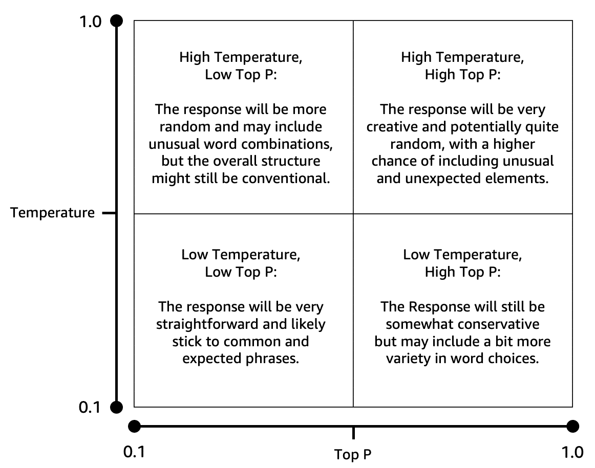

# Demostración de Configuración de Parámetros de Modelo en Amazon Bedrock

---

## Acceder al Playground de Chat

1.  En la Consola de administración de AWS, busca y selecciona **Amazon Bedrock**.
2.  En el panel de navegación, ve a **Playgrounds** y elige **Chat / Texto**.

## Seleccionar un Modelo

1.  En el panel del playground de chat, haz clic en **Seleccionar modelo**.
2.  Elige un proveedor y un modelo de la lista.
3.  Haz clic en **Aplicar**.

## Ajustes de Parámetros y Generación de Texto

En el panel **Configuraciones**, dentro de la sección **Aleatoriedad y diversidad**, encontrarás los parámetros de **Temperatura** y **Top P**, que controlan la creatividad de las respuestas. A continuación, se detalla un proceso de prueba con diferentes combinaciones:

1.  **Primera ejecución (valores predeterminados):**
    * Deja **Temperatura** y **Top P** en sus valores predeterminados.
    * En el cuadro de _prompt_, introduce: "Escribe una historia corta sobre un día en la vida de un extraterrestre que visita la Tierra por primera vez."
    * Haz clic en **Ejecutar**.

2.  **Segunda ejecución (mayor aleatoriedad):**
    * Establece **Temperatura** en `1` y **Top P** en `0.1`.
    * Pega el mismo _prompt_ y haz clic en **Ejecutar**.

3.  **Tercera ejecución (menor aleatoriedad):**
    * Establece **Temperatura** en `0.2` y **Top P** en `0.9`.
    * Pega el _prompt_ y haz clic en **Ejecutar**.

4.  **Cuarta ejecución (baja temperatura y top P):**
    * Establece **Temperatura** en `0.2` y **Top P** en `0.1`.
    * Pega el _prompt_ y haz clic en **Ejecutar**.

## Análisis de los Resultados

Después de generar las cuatro historias, puedes comparar las variaciones para observar cómo los ajustes en **Temperatura** y **Top P** afectaron la creatividad y la previsibilidad de cada versión. La **temperatura** controla la aleatoriedad de las respuestas, mientras que el **Top P** influye en la selección de tokens. Al combinar estos parámetros, puedes guiar al modelo para que genere desde respuestas más predecibles y directas hasta resultados más creativos e inesperados.

