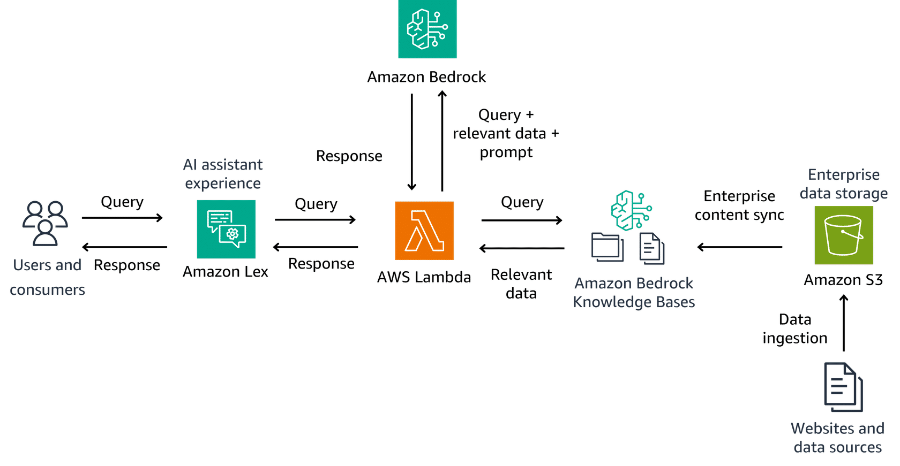

# Arquitectura de Amazon Bedrock

## Estructura y Funcionamiento

Amazon Bedrock se ejecuta como un **marco sin servidor totalmente administrado** que se conecta a modelos de base a través de una interfaz unificada. Su arquitectura se compone de los siguientes elementos clave:

* **Consulta del usuario**: Los usuarios interactúan a través de una interfaz de usuario, como **Amazon Lex**, que comprende el lenguaje natural.
* **Cómputo y lógica empresarial**: La consulta se procesa en una capa de cómputo, a menudo con **AWS Lambda**, que enruta y orquesta la solicitud entre los diferentes servicios.
* **Datos relevantes**: Los datos empresariales se almacenan en **Amazon S3** y se sincronizan con las **Knowledge Bases de Amazon Bedrock**, permitiendo el uso de **RAG (Generación Aumentada por Recuperación)** para mejorar la precisión de las respuestas.
* **Bases de conocimiento de Amazon Bedrock**: Almacenan y gestionan el contenido empresarial, indexándolo para que los modelos de fundación lo utilicen como contexto.
* **Respuesta de IA generativa**: Amazon Bedrock utiliza los modelos fundamentales para generar la respuesta, la cual es devuelta a Lambda para su procesamiento final.
* **Respuesta al usuario**: La respuesta final se envía de vuelta a la interfaz de usuario para ser entregada al usuario en lenguaje natural.

---

## Integraciones Clave de Amazon Bedrock

Amazon Bedrock se integra con la infraestructura existente de AWS para crear soluciones de IA generativa completas, seguras y escalables.

* **Amazon SageMaker AI**: Colabora con Bedrock para el ciclo de vida completo del aprendizaje automático. Mientras Bedrock proporciona modelos fundamentales, SageMaker ofrece capacidades complementarias para el desarrollo e implementación de modelos personalizados.
* **Amazon Kendra**: Mejora las capacidades de RAG con funcionalidad de búsqueda empresarial. Permite que Bedrock acceda a información de múltiples repositorios, mejorando la precisión y relevancia de las respuestas.
* **AWS Lambda**: Ejecuta el código que orquesta las interacciones entre Bedrock y otros servicios, manejando tareas como el preprocesamiento de entradas y el formato de respuestas.
* **Amazon Simple Storage Service (S3)**: Proporciona almacenamiento de objetos escalable para datos. Bedrock puede acceder directamente al contenido en los _buckets_ de S3, lo que simplifica los flujos de trabajo de datos.
* **Amazon OpenSearch Service**: Funciona con Bedrock para implementar sistemas eficientes de RAG, indexando documentos para capacidades de búsqueda semántica.
* **AWS Identity and Access Management (IAM)**: Controla el acceso a Bedrock y servicios relacionados, aplicando permisos detallados para proteger los datos sensibles.
* **Amazon CloudWatch**: Monitorea el rendimiento y el estado de las aplicaciones de Bedrock, recopilando métricas y registros para la optimización.
* **Amazon EventBridge**: Permite crear arquitecturas basadas en eventos, donde un evento de un servicio puede activar operaciones de un modelo de fundación en Bedrock.

---

## Consideraciones para la Integración

Al integrar Amazon Bedrock, es crucial tener en cuenta los siguientes factores para una implementación óptima:

* **Cumplimiento de seguridad**: Implementar cifrado, controles de acceso y medidas de cumplimiento para proteger los datos.
* **Optimización del rendimiento**: Equilibrar la selección del modelo y los ajustes de configuración para un rendimiento óptimo, gestionando los costos.
* **Planificación de escalabilidad**: Diseñar la integración para manejar cargas de trabajo variables y crecientes de manera eficiente.

