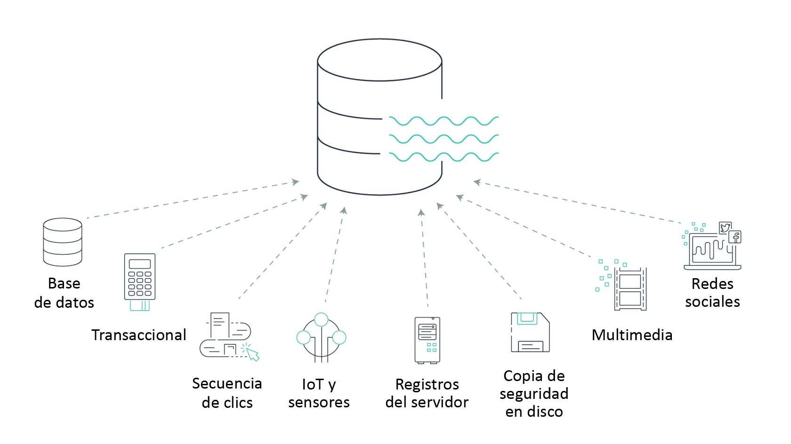

# Como hablar de la IA generativa con los empleados

# Cómo una organización puede adoptar el Machine Learning

Una organización puede pasar de tener pocos o ningún proyecto de **ML** a contar con una experiencia avanzada en producción después de completar varios proyectos de investigación y despliegues. Para lograrlo, se necesitan tres estrategias clave:

* Una estrategia de ML robusta
* Una estrategia de datos
* Una cultura de aprendizaje y colaboración

## Cómo AWS ayuda a implementar una estrategia de ML

Para implementar una estrategia de ML robusta, no es necesario empezar desde cero. **Amazon Web Services (AWS)** ofrece servicios que aceleran el proceso de adopción del ML en tu organización. Al aprovechar el ML en la nube de AWS, se evita el desarrollo y la formación de infraestructura en las instalaciones para los proyectos iniciales. Esto permite a tu equipo experimentar con el ML a un ritmo rápido.

## Estrategias para garantizar el éxito de la organización

Las organizaciones pueden comenzar a crear una estrategia de ML robusta mediante tres métodos:

1.  Encontrar el problema exacto
2.  Equivocarse y aprender de los errores
3.  Escalar más allá de las pruebas de concepto

### Estrategia 1: Encontrar el problema exacto

Una estrategia robusta comienza con el compromiso inicial de los ejecutivos y la identificación de problemas específicos a resolver con el ML. Elegir problemas que merecen la pena, como aquellos que no se pueden solucionar con medios tradicionales, que requieren muchos datos o que demandan una gran cantidad de mano de obra, puede generar éxito temprano e impulsar el proyecto.

* Problemas que consiguen el compromiso inicial de los ejecutivos
* Problemas que requieren muchos datos
* Problemas que no se pueden solucionar con los medios tradicionales
* Problemas que demandan gran cantidad de mano de obra

La mejor manera de ganar impulso es conseguir el compromiso inicial de los ejecutivos y encontrar problemas que puedan generar éxito temprano.

### Estrategia 2: Equivocarse y aprender de los errores

Los errores no son perjudiciales si los cambios son pequeños y se incentiva a volver a intentarlo. Esto significa utilizar los errores de forma intencionada como camino hacia el éxito. La metodología del ML implica usar los errores como una oportunidad iterativa para ser tolerante a ellos y encontrar una solución exitosa en intentos posteriores. Muchos resultados exitosos se obtienen después de muchas rondas de iteración.

### Estrategia 3: Escalar más allá de las pruebas de concepto (POC)

Las **POC** (Pruebas de Concepto) prueban el diseño, la idea o las suposiciones de un producto o servicio y determinan su viabilidad. Las POC de ML se pueden utilizar para resolver los desafíos de escalado en toda la empresa antes de realizar grandes inversiones en producción.

**Nota:** El machine learning es un proceso iterativo. Aprende de las iteraciones fallidas para volverte tolerante a los errores.

## Enfoque de cambio cultural

Para cambiar una organización de un hub centralizado de científicos de datos a una estructura descentralizada, donde la experiencia se distribuye entre las unidades de negocio, se requieren varios cambios ideológicos. El ML necesita cambios en la toma de decisiones, la administración del rendimiento y los sistemas organizativos para facilitar la colaboración continua.

**Modelos radiales:**

* **Descripción:** Los "radios empresariales" (unidades de negocio) trabajan con equipos centralizados de ciencia de datos y tecnología de la información.
* **Colaboración:** Las unidades de negocio individuales trabajan con operaciones centralizadas de ciencia de datos y tecnología de la información, con el apoyo de datos.
* **Combinación:** Las unidades de negocio se combinan con científicos de datos y trabajan con operaciones centralizadas de tecnología de la información.

En un modelo radial, las unidades de negocio se combinan con los científicos de datos que trabajan con tecnología de la información centralizada.

## Resumen de la lección

En esta lección, hemos analizado las siguientes preguntas:

* ¿Cómo puedo preparar mi organización para que utilice el ML?
* ¿Cómo puede ayudarme AWS?
* ¿Qué otras estrategias puedo adoptar para garantizar el éxito de la organización?
* ¿Qué enfoque de cambio cultural es adecuado para mi organización?

# Opciones para establecer una estrategia de ML robusta

Para establecer una estrategia de Machine Learning (ML) sólida en una organización, se deben considerar tres enfoques principales que promueven un desarrollo efectivo y sostenible. Estos son:

---

## 1. Encontrar problemas exactos

Las organizaciones deben enfocarse en problemas que realmente **requieran** el uso de ML. Esto incluye desafíos que:
* Necesitan **muchos datos** para ser resueltos.
* Demandan una **gran cantidad de mano de obra**.
* No pueden ser solucionados de manera efectiva con **medios tradicionales**.

Abordar este tipo de problemas desde el inicio ayuda a demostrar el valor del ML y a obtener el compromiso de los líderes de la organización, lo cual es crucial para el éxito a largo plazo.

---

## 2. Equivocarse y aprender de los errores

El **ML es un proceso iterativo**. Es fundamental que las organizaciones adopten una cultura que permita y tolere el fracaso. Los errores deben verse como oportunidades para aprender y mejorar. Al cometer "errores intencionales" en etapas tempranas, los equipos pueden ajustar sus modelos y metodologías de forma rápida, lo que acelera el camino hacia el éxito final.

---

## 3. Escalar más allá de las pruebas de concepto (POC)

Muchos proyectos de ML se estancan en la fase de prueba de concepto. Una estrategia robusta implica planificar y ejecutar la transición de las **POC exitosas a la producción**. Esto significa asegurar que los modelos sean **escalables**, se puedan integrar en los sistemas existentes de la empresa y se mantengan de manera efectiva, lo que transforma una idea experimental en una solución de negocio funcional.

# La importancia de los datos tabulares

Los datos tabulares seguirán siendo importantes porque son el formato más común y estructurado de la información, fácil de entender y procesar para las computadoras. Se utilizan en innumerables aplicaciones, desde bases de datos de clientes hasta hojas de cálculo financieras, y son la base para muchos modelos de Machine Learning.

---

## Cómo evaluar su estrategia de datos

Una estrategia de datos eficaz comienza evaluando la calidad de los datos actuales de su organización. Existen tres niveles de madurez en la calidad de los datos que puede considerar:

### Aceptable
* **Estado:** Los datos no están procesados ni etiquetados, por lo que requieren trabajo antes de ser utilizados para el **ML**.
* **Solución:** Etiquete los datos con herramientas especializadas, como **Amazon SageMaker Ground Truth**, para prepararlos para el entrenamiento de modelos.

### Mejor
* **Estado:** Los datos están etiquetados, pero se encuentran en fuentes dispares y son accesibles solo para equipos específicos.
* **Solución:** Unifique todos los orígenes de datos en un **repositorio central o "fuente de información"** para democratizar el acceso y mejorar la coherencia.

### Óptima
* **Estado:** Los datos están etiquetados, se encuentran en un repositorio central y son accesibles para todos los equipos de la organización. Este es el estado ideal para una estrategia de datos madura.

---

## Cómo mejorar su estrategia de datos

Las organizaciones pueden desarrollar planes estratégicos para la recopilación y el uso de datos, incluso en las primeras etapas de las **Pruebas de Concepto (POC)**, lo que es clave para revolucionar su sector con el ML.

Los datos son el fundamento para los líderes que buscan revolucionar sus sectores con el Machine Learning.

---

## Beneficios de trasladarse a un lago de datos

Los **lagos de datos** son un componente central cada vez más popular en los modelos de ML eficientes. Un lago de datos es un único almacén que puede almacenar una variedad de tipos de datos a cualquier escala y a un costo bajo, incluyendo:
* Datos transaccionales
* Bases de datos
* Secuencias de clics
* Datos de **IoT** y sensores
* Registros
* Archivos multimedia
* Actividad de redes sociales

Los lagos de datos no solo democratizan el acceso y el análisis de la información, sino que también ofrecen beneficios adicionales:

* **Clasificación y búsqueda:** Permiten clasificar, buscar y encontrar datos relevantes en un repositorio central.
* **Almacenamiento:** Almacenan todo tipo de datos a cualquier escala y a bajo costo.
* **Seguridad:** Protegen los datos y previenen el acceso no autorizado.
* **Análisis:** Facilitan nuevos tipos de análisis de datos de forma rápida, lo que permite el análisis predictivo y en tiempo real, la **Inteligencia Artificial (IA)** y el ML.

Los lagos de datos permiten un amplio conjunto de motores analíticos que impulsan el análisis, predictivo y en tiempo real, la IA y el ML.

---

## Resumen de la lección

En esta lección, hemos explorado:

* ¿Cómo evaluar su estrategia de datos?
* ¿Cómo mejorar su estrategia de datos?
* Los beneficios de utilizar un lago de datos.

# Mejorar las habilidades de los empleados en IA generativa

Para mejorar las habilidades de los empleados en el uso de la **IA generativa**, es fundamental implementar un enfoque estructurado que abarque la capacitación técnica y el desarrollo de una cultura de innovación.

---

## 1. Capacitación y desarrollo

### Talleres prácticos
Organice talleres interactivos centrados en herramientas de IA generativa (por ejemplo, modelos de lenguaje grandes, generadores de imágenes). Asegúrese de que los empleados puedan experimentar y crear proyectos reales, lo que facilitará una comprensión más profunda de cómo aplicar la tecnología a sus tareas diarias.

### Programas de mentoría
Asigne a empleados con experiencia en IA para que guíen a sus colegas menos familiarizados. La mentoría fomenta el aprendizaje continuo y crea una red de apoyo interna.

### Cursos y certificaciones
Invierta en cursos en línea y certificaciones que cubran los fundamentos de la IA, el **machine learning** y el uso de modelos generativos. Esto valida las habilidades de los empleados y los mantiene actualizados con las últimas tendencias.

---

## 2. Cultura de innovación

### Proyectos piloto
Anime a los equipos a lanzar pequeños proyectos piloto que utilicen IA generativa para resolver problemas específicos del negocio. Esto no solo genera resultados tangibles, sino que también desmitifica la tecnología y muestra su valor.

### Fomentar la experimentación
Cree un entorno donde los empleados se sientan seguros para experimentar sin miedo al fracaso. La experimentación es clave para descubrir nuevas aplicaciones y optimizar los flujos de trabajo con herramientas de IA.

---

## ¿Qué es un científico de datos?

Un **científico de datos** es un profesional que combina habilidades en el mundo empresarial y técnico para analizar grandes volúmenes de datos y generar resultados específicos para una organización. En el ámbito del **machine learning**, los científicos de datos se encargan de:
* Diseñar y construir modelos a partir de datos.
* Crear y trabajar con algoritmos.
* Entrenar modelos para hacer predicciones y alcanzar objetivos de negocio.

---

## Habilidades de un científico de datos

Las habilidades de un científico de datos son multidisciplinarias e incluyen el dominio de varias áreas clave. Algunos ejemplos de los dominios más importantes son:

* **Matemáticas y Estadística:** Para entender los algoritmos, realizar análisis predictivos y evaluar el rendimiento de los modelos.
* **Programación:** Dominio de lenguajes como Python o R, así como del uso de bibliotecas especializadas (ej. TensorFlow, PyTorch, Scikit-learn).
* **Conocimiento del Negocio:** Comprender el contexto empresarial para identificar problemas relevantes y traducir los resultados del análisis en soluciones que aporten valor a la organización.
* **Comunicación:** Capacidad para presentar hallazgos complejos de forma clara a audiencias no técnicas.

 
 
 
 

# Cómo construir un equipo de Machine Learning

No se puede esperar que los científicos de datos hagan todo. Se requieren otras habilidades para definir los objetivos empresariales que se alineen con los modelos y para producir la canalización de ML. Además, se necesitan recursos para administrar a las personas, los proyectos y la infraestructura.

---

## ¿Cómo es un equipo piloto de machine learning?

Un equipo piloto de ML puede estar formado por un **científico de datos**, un **ingeniero de ML** y un **director de programas técnicos**. Cada uno tiene distintas responsabilidades, pero todos cuentan con experiencia y habilidades relevantes en ML.

### Roles y Habilidades del Equipo Piloto
* **Científico de datos:**
    * **Rol:** Creación de modelos de ML.
    * **Habilidades:** Matemáticas, estadística, algoritmos de ML y procesamiento de datos.

* **Ingeniero de ML:**
    * **Rol:** Producción de modelos de ML.
    * **Habilidades:** Algoritmos de ML, herramientas de canalizaciones de datos, diseño de arquitectura y desarrollo de software.

* **Director de programas técnicos:**
    * **Rol:** Garantizar que el proyecto de ML cumpla los objetivos empresariales, temporales y técnicos.
    * **Habilidades:** Administración de proyectos, liderazgo y comprensión de alto nivel de los algoritmos de ML.

---

## ¿Cómo puede ayudar AWS a que mi equipo comience?

**Amazon SageMaker** es un servicio completamente administrado que puede ayudar a los desarrolladores y los científicos de datos a crear, entrenar e implementar modelos de ML con rapidez. SageMaker elimina las tareas arduas de cada paso del proceso de ML para que sea más fácil desarrollar modelos de alta calidad.

### Proceso de Machine Learning con Amazon SageMaker
1.  **Preparación:** Recupera los datos en un repositorio, depúralos, modifícalos, prepáralos y transfórmalos mediante la filtración de las partes irrelevantes y añade etiquetas.
2.  **Creación:** Elige un algoritmo de machine learning con un estilo de aprendizaje que se adapte a tus necesidades. Estos algoritmos pueden clasificarse como:
    * Formación supervisada
    * Formación no supervisada
    * Aprendizaje por refuerzo
3.  **Entrenamiento:** Se necesitan recursos de computación, redes y almacenamiento para llevar a cabo el entrenamiento. Evalúa el modelo para determinar si la exactitud de las inferencias es aceptable.
4.  **Despliegue:** Cuando se despliega un modelo en producción para hacer predicciones, la inferencia representa la mayor parte del coste.

---

## ¿Cómo desarrollar mi equipo para el análisis de ML?

Un equipo de ML puede crecer rápidamente a través de varias fases de desarrollo, que incluyen la colaboración interdisciplinaria, la formación y la contratación de expertos en el dominio.

### Fase 1
* Anima a tu equipo técnico, y no solo a los científicos, a utilizar el ML.
* Anima a los líderes no técnicos a convertirse en expertos en ML.
* **Formación, formación y más formación.**

### Fase 2
* Si es posible, contrata científicos de datos.
* Colabora con equipos externos, como el **Amazon Machine Learning (ML) Solutions Lab**, para ayudar a desarrollar capacidades.

Haz estas preguntas a todos los equipos (investigación, ingeniería de software, recursos humanos): **¿cómo utilizaréis el machine learning?**

---

## ¿Cómo puedo desarrollar mi equipo para obtener experiencia técnica?

La creación de una cultura de aprendizaje y colaboración es un proceso que se puede iniciar con actividades emocionantes para motivar a la organización, con formación para mejorar las habilidades de los equipos internos y con programas de aceleración para adquirir competencias en ML.

### 1. Eventos Emocionantes
Puedes comenzar con actividades divertidas y prácticas para entusiasmar al personal técnico. Un ejemplo es la participación de DBS Bank en la liga **AWS DeepRacer** de empresas privadas.
* [Video de DBS en la liga AWS DeepRacer](https://www.youtube.com/watch?v=OFlzbGdKFoM)

### 2. Formación
Tanto la formación formal como la informal son importantes.
* **Formación formal:** Sesiones con instructor, actividades grupales y laboratorios prácticos.
* **Formación informal:** Aprendizaje autodirigido y "justo a tiempo".
* [Sitio web de Amazon Machine Learning](https://aws.amazon.com/training/learn-about/machine-learning/)

### 3. Programas de Aceleración
Combinan prácticas recomendadas y estrategias probadas para una transición exitosa a la **IA**. Proporcionan a las organizaciones formación, orientación y asistencia de implementación para iniciar con éxito su proceso de ML.
* **Ejemplo:** El programa **AWS Machine Learning Embark**.
* [Sitio web del programa AWS ML Embark](https://aws.amazon.com/ml-embark/)

---

## ¿De qué otra forma puede ayudar AWS a mi equipo a lograr el éxito rápidamente?

Varios servicios administrados proporcionan canalizaciones de ML prediseñadas que se pueden aplicar a los problemas de forma automatizada.

* **Amazon Kendra:** Para crear un servicio de búsqueda interna.
* **Amazon Comprehend:** Para clasificar texto del usuario según el sentimiento.
* **Amazon Personalize:** Para crear un servicio de personalización y recomendación para los clientes.
* **Amazon Forecast:** Para pronosticar las necesidades y los resultados empresariales.
* **Amazon Rekognition:** Para generar etiquetas de metadatos a partir de imágenes y hacerlas buscables.
* **Amazon Fraud Detector:** Para identificar actividades en línea potencialmente fraudulentas.

Cuando se pregunta a los equipos cómo utilizarán el machine learning, se refuerza la importancia del ML en sus áreas de propiedad y se les anima a colaborar para desarrollar oportunidades interesantes.

---

## ¿Qué otros roles secundarios necesitaré?

Se necesitarán roles adicionales para definir y garantizar que el modelo se alinee con los objetivos empresariales, para administrar el funcionamiento de la canalización de ML y para gestionar a las personas, los proyectos y la infraestructura. En el diagrama a continuación, se muestran varios roles secundarios de ML.

 
 
 

# Cómo liderar un cambio cultural hacia el Machine Learning

Como líder, para respaldar el cambio cultural hacia la adopción del Machine Learning (ML), es crucial tomar varias medidas proactivas que aborden tanto el aspecto técnico como el humano de la organización. A continuación, se detallan las acciones clave que puede implementar:

---

## 1. Explicar los motivos

Antes de iniciar cualquier iniciativa, es fundamental comunicar **por qué** se está adoptando el ML. Explique los beneficios para la empresa, como la eficiencia operativa, la toma de decisiones basada en datos y la capacidad de innovar. Asegúrese de que todos los empleados, desde los equipos técnicos hasta los líderes de negocio, comprendan la visión y cómo el ML contribuirá al éxito de la organización.

---

## 2. Anticipar y superar obstáculos

Es probable que la transición se encuentre con resistencia. Como líder, debe anticiparse a los obstáculos comunes, como el miedo al cambio, la falta de habilidades o la preocupación por la seguridad laboral. Para mitigar estos problemas, ofrezca formación continua, fomente una cultura de aprendizaje y celebre los pequeños logros para demostrar que el proceso es factible y beneficioso.

---

## 3. Preparar un presupuesto

La integración de nuevas tecnologías de ML requiere una inversión significativa. Es vital que prepare un presupuesto adecuado que cubra no solo la tecnología en sí (hardware, software, servicios en la nube como **AWS**), sino también los costos de capacitación, el desarrollo de talento y las herramientas necesarias para la adopción. Un presupuesto bien planificado demuestra el compromiso de la dirección con la iniciativa.

---

## 4. Equilibrar viabilidad, tiempo y valor

Los líderes deben ser realistas al establecer expectativas. Un proyecto de ML exitoso equilibra la **viabilidad técnica** (¿se puede hacer?), el **tiempo** (¿cuánto tardará?) y el **valor para el negocio** (¿cuál es el retorno de la inversión?). Comience con proyectos pequeños que ofrezcan resultados rápidos y tangibles para generar impulso y confianza antes de abordar iniciativas más grandes y complejas.

---

## Resumen de la lección

En esta lección, hemos abordado preguntas clave sobre la implementación del ML en una organización:
* ¿Qué debo hacer para crear una cultura de aprendizaje y colaboración?
* ¿Cómo es un equipo piloto de ML?
* ¿Qué es un científico de datos?
* ¿Cuáles son las habilidades que debe poseer un científico de datos?
* ¿Qué otros roles secundarios necesitaré?
* ¿Cuáles son las responsabilidades principales?

La acción que **no** es una medida que un líder debería llevar a cabo para fomentar la adopción temprana del ML es **configurar una infraestructura de ML completa**.

---

## Razonamiento

En las etapas iniciales de la adopción del **Machine Learning (ML)**, el enfoque principal debe ser el aprendizaje, la experimentación y la validación de ideas. Configurar una infraestructura de ML completa y a gran escala desde el principio es una inversión significativa de tiempo y recursos que no es necesaria para las **pruebas de concepto (POC)** iniciales.

En su lugar, los líderes deben centrarse en:

* **Crear POC rápidas y pequeñas** para identificar los casos prácticos más prometedores y demostrar el valor del ML.
* **Permitir la experimentación y los errores**, ya que el ML es un proceso iterativo en el que el aprendizaje de los fracasos es crucial.
* **Asegurarse de que los datos estén completos y sean de fácil acceso**, ya que los datos de alta calidad son la base de cualquier proyecto de ML exitoso.
* **Promover la colaboración interdisciplinaria** entre los equipos de negocio, datos y tecnología para garantizar que los proyectos de ML se alineen con los objetivos de la organización.

---

# Cómo inculcar el pensamiento de la IA generativa en tu organización

Para comenzar a inculcar el pensamiento de la IA generativa en tu organización, es crucial que los equipos de investigación, ingeniería de software y recursos humanos trabajen juntos. Deben determinar cómo se utilizará el Machine Learning (ML), identificar los desafíos de la adopción y desarrollar estrategias claras para superarlos.

---

## El proceso de una organización en materia de ML

El proceso de adopción del ML varía según el nivel de experiencia de la organización. Considera el ejemplo de un director de experiencia (CXO) de una empresa minorista que busca aprovechar el ML para diversos casos prácticos.

### 1. Experiencia limitada
Cuando un equipo comienza su proceso, la falta de experiencia puede limitar el éxito. Para maximizar el progreso, se deben seguir estos pasos:
* **Enfocarse en casos de uso sencillos** y bien definidos.
* **Crear pequeñas pruebas de concepto (POC)** para demostrar el valor.
* **Aprovechar servicios gestionados** como **Amazon SageMaker** para reducir la complejidad.

### 2. Algunas cargas de trabajo en producción
Después de varios despliegues, el éxito puede seguir siendo limitado. En esta fase, es crucial:
* **Optimizar y refinar** los modelos y las canalizaciones existentes.
* **Establecer una estrategia de datos** más sólida.
* **Fomentar la colaboración** entre los equipos para resolver problemas complejos.

### 3. Varias cargas de trabajo en producción
Una vez que el equipo se ha acostumbrado a completar despliegues, el éxito puede incluir estrategias a largo plazo y objetivos organizativos. En este punto, se debe:
* **Escalar las soluciones** a través de la empresa.
* **Invertir en la formación y el desarrollo de habilidades** de los empleados.
* **Evaluar el impacto estratégico** de cada proyecto de ML en los objetivos de la organización.

**Nota:** Algunos resultados exitosos solo se producen después de muchas rondas de iteración. Algunos resultados no tienen ningún éxito.

---

## Errores más comunes en el proceso de adopción del ML

Comenzar el proceso hacia el ML puede no ser sencillo. Estos son algunos de los errores comunes:

* **Considerar la IA como una tecnología de "plug-and-play"** con beneficios inmediatos. La IA requiere un esfuerzo significativo de integración, entrenamiento y ajuste.
* **Pensar de manera demasiado limitada** en las aplicaciones de la IA. El mayor impacto se logra cuando se exploran soluciones innovadoras en múltiples áreas del negocio.

**La IA tiene su mayor impacto cuando la desarrollan equipos multifuncionales con una combinación de habilidades y perspectivas.**

---

## Conclusiones importantes

Para ayudar a una organización a seguir su camino hacia el ML y la IA, hay varias ideas clave:

### 1. Obtener el patrocinio ejecutivo
El patrocinio ejecutivo puede maximizar el camino hacia el ML al respaldar el desarrollo de pruebas de concepto y fortalecer la capacidad organizativa. Un líder comprometido puede impulsar la adopción y asegurar los recursos necesarios.

### 2. Utilizar las pruebas de concepto (POC)
Las **POC** deben ser pruebas pequeñas y seguras en caso de error. Su propósito es mostrar de forma progresiva partes de una solución para uno o más objetivos empresariales, generando así compromiso con el ML en toda la organización.

### 3. Permitir la experimentación
Los equipos de ML deben tener la libertad de formular problemas, investigar, experimentar, evaluar el riesgo y probar hipótesis. Cada solución puede requerir muchas rondas de iteración para tener éxito, y algunas nunca lo logran.

### 4. Examinar la estrategia de datos
Evalúe, etiquete y centralice los datos relevantes en una única **fuente de información**, como un lago de datos, para que estén disponibles y sean accesibles para otros equipos de la organización.

### 5. Mejorar la colaboración
Los expertos en la materia de ciencia de datos deben pertenecer de forma permanente a varios equipos y unidades de negocio. La **IA** tiene su mayor impacto cuando la desarrollan equipos multifuncionales con una combinación de habilidades y perspectivas.

---

## Resumen

La creación de una organización preparada para el ML requiere un liderazgo ejecutivo sólido, una estructura de equipo bien definida y cambios culturales para tener éxito.

En esta lección, hemos analizado las siguientes preguntas:
* ¿Cómo comienzo mi proceso hacia el ML?
* ¿Cómo es el proceso que debe seguir una organización en materia de ML?
* ¿Cuál es un ejemplo de caso empresarial relacionado con el progreso de una organización?

---

# ¿Cuál es un error común en el proceso hacia el ML?

El error común en el proceso de adopción del Machine Learning es **considerar la IA como una tecnología de plug-and-play con beneficios inmediatos.**

---

### ¿Por qué es un error?

La **IA** y el **Machine Learning (ML)** no son soluciones que se puedan implementar de forma automática para obtener resultados instantáneos. Requieren un proceso iterativo de:

* **Preparación de datos:** Limpieza, etiquetado y organización.
* **Desarrollo del modelo:** Diseño, entrenamiento y ajuste de algoritmos.
* **Integración:** Conexión con los sistemas y flujos de trabajo existentes de la empresa.

Ignorar estos pasos y esperar un resultado inmediato puede llevar a la frustración y al fracaso del proyecto. Por el contrario, los proyectos de ML exitosos se construyen sobre una base sólida de experimentación, aprendizaje de los errores y colaboración.